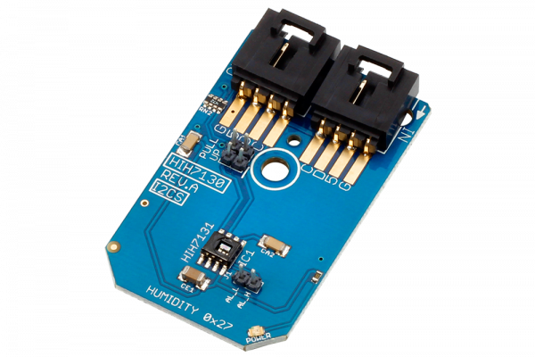

[](https://store.ncd.io/product/hih7130-humidity-and-temperature-sensor-%C2%B13-rh-%C2%B11-0c-i2c-mini-module/).

# HIH7130

Honeywell HumidIcon Digital Humidity/Temperature Sensors are digital output-type relative humidity and temperature sensors combined in the same package.These sensors provide an accuracy level of ±3%RH.They possess industry-leading long-term stability and reliability, true temperature-compensated digital I2C, energy efficiency, and ultra-small package size and options.
This Device is available from www.ncd.io

[SKU: HIH7130]

(https://store.ncd.io/product/hih7130-humidity-and-temperature-sensor-%C2%B13-rh-%C2%B11-0c-i2c-mini-module/)
This Sample code can be used with Raspberry Pi.

Hardware needed to interface HIH7130 humidity and temperature sensor With Raspberry Pi :

1. <a href="https://store.ncd.io/product/hih7130-humidity-and-temperature-sensor-%C2%B13-rh-%C2%B11-0c-i2c-mini-module/">HIH7130 humidity and temperature Sensor</a>

2. <a href="https://store.ncd.io/product/i2c-shield-for-raspberry-pi-3-pi2-with-outward-facing-i2c-port-terminates-over-hdmi-port/">Raspberry Pi I2C Shield</a>

3. <a href="https://store.ncd.io/product/i%C2%B2c-cable/">I2C Cable</a>

## Python

Download and install smbus library on Raspberry pi. Steps to install smbus are provided at:

https://pypi.python.org/pypi/smbus-cffi/0.5.1

Download (or git pull) the code in pi. Run the program.

```cpp
$> python HIH7130.py
```
The lib is a sample library, you will need to calibrate the sensor according to your application requirement.
